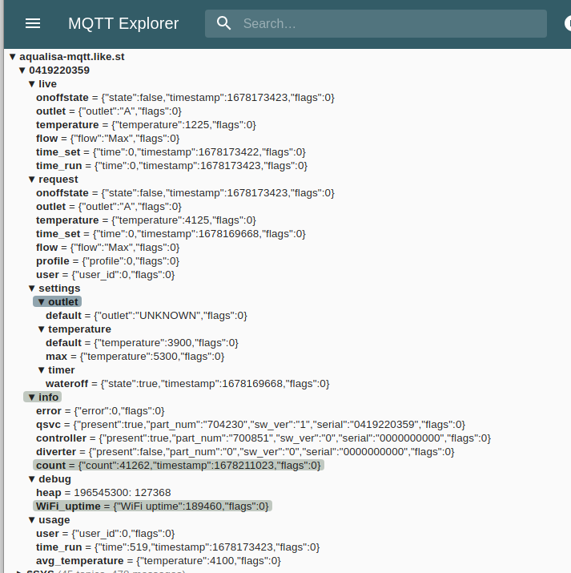

# MQTT-MITM
This is an attempt to inercept the communication between an Auqalisa shower and the mothership, which appears to happen over an encrypted MQTT link

## MQTT
MQTT is basically a system (broker) where clients can connect and send messages attached to topics.  Any client can send any message on any topic and any client can read any message sent.  A client can subscribe to a topic which means it will get notified if any other client sends a message on that topic.  MQTT generally works on two different ports.  1883 is unencrypted, 8883 is over a TLS connection.

## Dissecting what is going on.
The shower opens a connection to `aqualisa-mqtt.like.st` on 8883 so this is likely to be a secured MQTT connection.

The first step is to set up our own MQTT server and see if we can get the shower to talk to that instead.

``` 
sudo apt install mosquitto 
sudo cp certs/server.* certs/ca.* /etc/mosquitto/conf.d
sudo vi /etc/mosquitto/conf.d/shower.conf
```
(you don't have to use my certs, it'll just save you a few minutes Googling how to use openssl)

Now add the following into the file shower.conf
```
listener 8883  0.0.0.0
allow_anonymous true
tls_version tlsv1.2
cafile /etc/mosquitto/conf.d/ca.crt 
certfile /etc/mosquitto/conf.d/server.crt
keyfile /etc/mosquitto/conf.d/server.key
connection_messages true
```
and start/restart the broker.  Now you need to change whatever does DNS on your local network so that the name `aqualisa-mqtt.like.st` resolves to the IP address of the machine that is running mosquitto.

Reboot your shower, and it should connect to your broker instead of the Aqualisa one.  If it doesn't, `ping aqualisa-mqtt.like.st`and check the name resolution is what you expect.

Your shower should now be spamming your broker with debug messages and some other status.



This enables us to set up read only access to the live data from the shower in Home Assistant etc.

## Where Next
The code in this repo is a horrible mashup of https://github.com/johanmeijer/grott and https://github.com/nikitastupin/mitmproxy-mqtt-script I assume that the shower subscribes to a topic that Aqualisa uses to send it commands to turn on/off and set temperature.  I wanted to put this code inbetween so I could capture the commands coming the other way, but I suspect I'm going to be foiled by a client cert burnt into the shower.

## Update 11/03/2023
All this code is redundant.  In oredr to find out what the shower subscribes to I only had to increase the log level of the broker.  This revealed the following subscriptions
```
<id>/request/+
<id>/settings/#
<id>/experience/# 
<id>/debug/#
```
Poking the obvious `{"state": true}` into `request/onoffstate`turns the shower on and `{"temperature":4600}`sets the temperature to 46C.

The moral of the story is, if you have an MQTT broker, your shower belongs to you.
